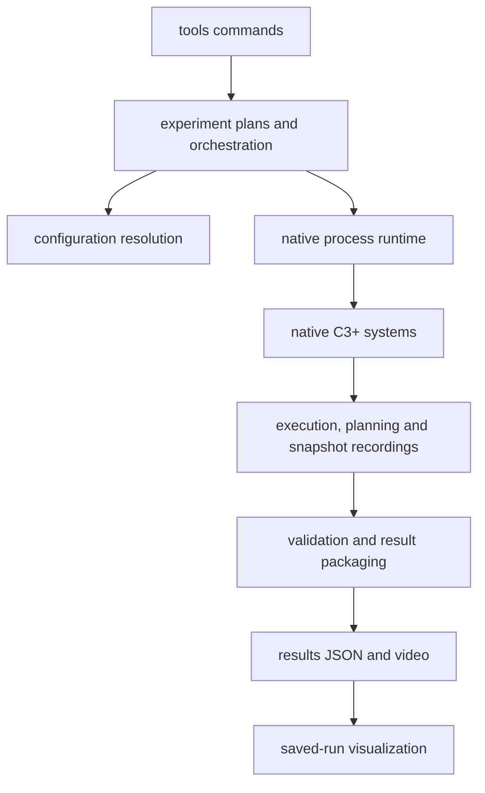

# Repository architecture

`tools` owns user-facing commands. `c3plus` contains the Python implementations,
organized by responsibility. Native C3+ source, shared YAMLs and model assets
remain under [examples/sampling_c3](../examples/sampling_c3/README.md).

## Responsibilities

| Package | Owns |
| --- | --- |
| [configs](../c3plus/configs/) | Canonical paths, scene/object catalogue, selected trial resolution, isolated YAML snapshots and asset-reference validation |
| [experiments](../c3plus/experiments/) | Pure plans, one-run orchestration, ordered campaigns, stop/resume and summaries |
| [runtime](../c3plus/runtime/) | Native process launch/lifecycle, flags, LCM transport, environment checks and launch-time source provenance |
| [recording](../c3plus/recording/) | Recorder coordination, native execution boundaries, planning updates and asynchronous snapshots |
| [evaluation](../c3plus/evaluation/) | Saved-data schema, pure projections, offline metrics, validation, metadata recovery and safe packaging |
| [visualization](../c3plus/visualization/) | Recorded video replay, diagnostic cost figures, camera geometry, object previews and preview EE sampling |
| [utils](../c3plus/utils/) | Small generic serialization helpers; strict parsing and output sanitization retain their distinct policies |
| [tools](../tools/) | Thin public command adapters and the `python3 -m tools` dispatcher |
| [tests](../tests/) | Tests grouped by their source responsibility, with shared fixtures and integration checks |
| [docker](../docker/) | Toolchain image and host/container environment setup |
| [build_support](../build_support/) | Bazel dependency rules/templates and optional build overrides |

## Data flow and dependencies

The diagram shows the main run's data flow. Offline commands can call evaluation
or visualization directly. Library modules do not import `tools`. Configuration
is foundational; it does not launch processes. Runtime does not depend on
experiment orchestration or evaluation. Evaluation consumes saved data and does
not launch experiments. Visualization is loaded only when requested; it is not
part of controller execution.

[plan.py](../c3plus/experiments/plan.py) describes a trial without writing or
launching it. [run.py](../c3plus/experiments/run.py) preserves the order of config
snapshot, native launch/recording, validation, rendering and consolidation under
the checkout's run lock. The runtime owns process groups, signal cleanup, log
forwarding and return codes. The package writer validates and persists the
consolidated JSON before deleting any intermediate evidence.

The renderer exposes an internal module entry for isolated packaging processes;
normal users invoke `python3 -m tools render`. Both use the same parser and
implementation. The same separation applies to previews and cost figures.

## Paths and generated data

- Native C++, message definitions, Bazel targets, models and
  `examples/sampling_c3/shared_parameters/` keep their existing paths.
- Python scene YAMLs live in [configs/scenes](../c3plus/configs/scenes/); the saved
  campaign manifest lives in [experiments/manifests](../c3plus/experiments/manifests/).
- Run-local `config/`, `config/repository/`, log and raw recording names remain
  artifact contracts. Complete runs retain one result JSON and one MP4.
- `results/` holds ignored generated evidence, grouped into smoke checks,
  Table-II campaigns, object-generalization runs and historical archives.
- `.build/` contains ignored Bazel shortcuts. The actual compiled objects and
  external sources stay in the configured cache volume.
- Root `MODULE.bazel`, `BUILD.bazel`, `WORKSPACE`, `.bazelrc`, `.bazeliskrc` and
  `.bazelignore` stay where Bazel and compatible tools discover them.
  [tools/bazel](../tools/bazel) remains Bazelisk's wrapper; the ROS-free override
  and Gurobi integration live in `build_support/`.

## Preserved scientific boundary

The reorganization changes locations and imports. Controller behavior, ADMM,
sampling, repositioning, costs, seed selection, geometry and simulation physics
remain native responsibilities with unchanged values. Execution, planning,
snapshot counts and JSON scientific definitions remain distinct and unchanged.
See [evaluation_schema.md](evaluation_schema.md) for those definitions and
[reproduction.md](reproduction.md#troubleshooting) for retained limitations.

Tests mirror the packages rather than collecting all behavior in one workflow
file. Run `python3 -m unittest discover -s tests` inside the container. Fixtures
exercise configuration equivalence, raw record alignment, packaging, process
cleanup and previews without running a scientific campaign.
